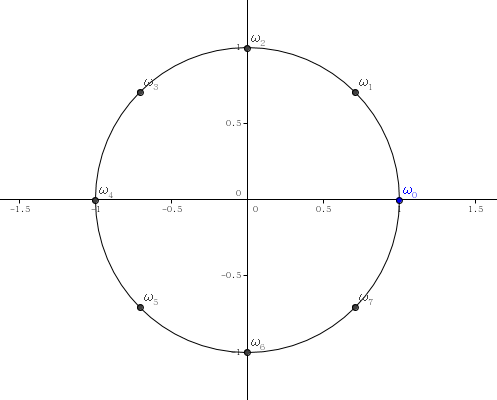

## 前言

听说FFT是个很有用的东西，于是本菜鸡就~~去背了模板~~尝试着看了一下。这里写下菜鸡版教程。

## 卷积

FFT主要用于求卷积。然而卷积是什么？

如果$f$是一个$n$次多项式，$g$是$m$次多项式，那么它们的卷积
$$
h(x)=f(x)g(x)=\sum_{i=0}^n\sum_{j=0}^mf_ig_jx^{i+j}=\sum_{i=0}^{n+m}\sum_{j=0}^if_{i-j}g_jx^i
$$
我们冷静分析一波，发现这就是个多项式乘法……

一般情况下，求卷积的时间复杂度是$O(n^2)$的。我们尝试加速这一过程。

## 点值表达与离散傅里叶变换

一般的，一个多项式可以表示为
$$
A(x)=a_0+a_1x+a_2x^2+...+a_nx^n
$$
这叫系数表示。

而一个$n$次多项式可以由$n+1$个互不相同的$(x,A(x))$唯一确定，其中
$$
A(x)=\{(x_0,A(x_0)),(x_1,A(x_1)),...,(x_n,A(x_n))\}
$$
叫做点值表示。

然后我们发现，点值表达有一个非常厉害的地方（$A$是$n$次多项式，$B$是$m$次多项式）：
$$
A(x)=\{(x_0,A(x_0)),(x_1,A(x_1)),...,(x_{n+m},A(x_{n+m}))\}\\
B(x)=\{(x_0,B(x_0)),(x_1,B(x_1)),...,(x_{n+m},B(x_{n+m}))\}\\
A(x)B(x)=\{(x_0,A(x_0)B(x_0)),(x_1,A(x_1)B(x_1)),...,(x_{n+m},A(x_{n+m})B(x_{n+m}))\}\\
$$
也就是说，我们可以在$O(n)$的时间内求出两个点值表达式相乘的结果！这可比先前的$O(n^2)$快了不少。

于是我们就想利用点值表达的这一特性来加速卷积过程。思路也很明显了：先将系数表示通过离散傅里叶变换（DFT）变成点值表示，求出乘积后，通过逆离散傅里叶变换（IDFT）转回系数表示。但是怎么进行DFT和IDFT呢？现在看来都是$O(n^2)$的……（IDFT通过拉格朗日插值实现，高斯消元是$O(n^3)$的）

## 单位复根

DFT的过程能降到$O(n\log n)$全靠单位复根。

$n$次单位复根是$n$个互不相同的$\omega^n=1$的复数。它们在复平面中的位置恰好将单位圆$n$等分。它们分别是$\omega_n^t=\cos \frac{2\pi t}{n}+i\sin\frac{2\pi t}{n}$，$t=0,1,...,n-1$。

$n=8$时差不多长这样：



结合图像，我们能得到一些显而易见的性质：
$$
\omega_{kn}^{ki}=\omega_n^i\\
\omega_n^i=-\omega_n^{i+\frac{n}{2}}
$$
然后我们就可以尝试DFT了。

## DFT

接下来，我们令$A$是一个$n$次多项式，$\deg A=n+1$。不妨将$\deg A$扩充到$2$的幂次。

要将$A$转成点值表示，我们需要取$\deg A$个值。

现在，我们要求$\overrightarrow{y}=(A(\omega_n^0),A(\omega_n^1),...,A(\omega_n^{n-1}))^T$。

令$A(x)=A^{[0]}(x^2)+xA^{[1]}(x^2)$（奇偶次项分开），我们可以得到：
$$
A(\omega_n^i)=A^{[0]}(\omega_n^{2i})+\omega_n^iA^{[1]}(\omega_n^{2i})=A^{[0]}(\omega_{\frac{n}{2}}^i)+\omega_n^iA^{[1]}(\omega_{\frac{n}{2}}^i)\\
A(\omega_n^{i+\frac{n}{2}})=A(-\omega_n^i)=A^{[0]}(\omega_{\frac{n}{2}}^i)-\omega_n^iA^{[1]}(\omega_{\frac{n}{2}}^i)
$$
所以求出
$$
\overrightarrow{y^{[0]}}=(A^{[0]}(\omega_{\frac{n}{2}}^0),A^{[0]}(\omega_{\frac{n}{2}}^1),...,A^{[0]}(\omega_{\frac{n}{2}}^{\frac{n}{2} - 1}))\\
\overrightarrow{y^{[1]}}=(A^{[1]}(\omega_{\frac{n}{2}}^0),A^{[1]}(\omega_{\frac{n}{2}}^1),...,A^{[1]}(\omega_{\frac{n}{2}}^{\frac{n}{2} - 1}))\\
\omega_n^i
$$
后就可以在$O(n)$时间内求出$\overrightarrow{y}$。这样的时间复杂度是$O(n\log n)$的。

## IDFT

有了$\overrightarrow{y}$，求$A$的过程叫IDFT。我们现在令$A$的系数组成向量$\overrightarrow a$。

该过程即解方程
$$
\begin{aligned}
\begin{pmatrix}
1 & \omega_n^0 &... & (\omega_n^0)^{n-1} \\
1 & \omega_n^1 &... & (\omega_n^1)^{n-1} \\
 & & ... & \\
1 & \omega_n^{n-1} & ... & (\omega_n^{n-1})^{n-1}
\end{pmatrix} \times \overrightarrow{a}=\overrightarrow{y}
\end{aligned}
$$
左边的系数矩阵是$n$阶的范德蒙德矩阵$V_n$。现在我们尝试求出$\overrightarrow{a}=V_n^{-1}\overrightarrow {y}$。

我们构造
$$
D_n=\begin{pmatrix}
1 & (\omega_n^{0})^1 & ... & (\omega_n^{0})^{n-1}\\
1 & (\omega_n^{-1})^1 & ... & (\omega_n^{-1})^{n-1}\\
& & ... & \\
1 & (\omega_n^{-n+1})^1 & ... & (\omega_n^{-n+1})^{n-1}
\end{pmatrix}
$$
那么
$$
(D_nV_n)_{i,j}=\sum_{k=0}^{n-1}D_{i,k}V_{k,j}=\sum_{k=0}^{n-1}(\omega_n^{-i})^k(\omega_n^k)^j=\sum_{k=0}^{n-1}\omega_n^{k(j-i)}
$$
而由于$j-i\in\{-n+1,n-1\}$，所以当$i=j$时，$(D_nV_n)_{i,j}=n$，否则$(D_nV_n)_{i,j}=\frac{1-(\omega_n^{j-i})^n}{1-\omega_n^{j-i}}=0$。

也就是说
$$
D_nV_n=nI_n
$$
所以
$$
V_n\overrightarrow{a}=\overrightarrow{y}\\
\Rightarrow\frac{1}{n}D_nV_n\overrightarrow{a}=\frac{1}{n}D_n\overrightarrow{y}\\
\Rightarrow\overrightarrow{a}=\frac{1}{n}D_n\overrightarrow{y}
$$
而我们发现DFT的过程实际上就是求
$$
\overrightarrow{y}=V_n\overrightarrow{a}
$$
所以只需要把DFT时$V_n$中的$\omega_n^i$换成$\omega_n^{-i}$即可(取虚部为相反数)。最后别忘了乘上$\frac{1}{n}$。

到此为止，已经可以写出递归版的FFT了。不过递归版的FFT常数比较大。我们来看进一步的优化：

## 蝴蝶操作

DFT时，我们要将系数奇偶分开。考虑递归过程中系数的变化：
$$
\begin{matrix}
0&1&2&3&4&5&6&7\\
0&2&4&6&1&3&5&7\\
0&4&2&6&1&5&3&7
\end{matrix}
$$

$$
\begin{matrix}
000&001&010&011&100&101&110&111\\
0&1&2 &3&4&5&6&7\\
\\
0&4&2&6&1&5&3&7\\
000&100&010&110&001&101&011&111
\end{matrix}
$$

发现什么了吧。

我们可以先将系数放到对应的位置，然后从下往上一步步合并就可以了。

## 参考代码

[题目链接](https://www.luogu.org/problemnew/show/P3803)

```c
#include <bits/stdc++.h>
#define LL long long
#define LD long double
using namespace std;

const int Maxn = 4000010;
const LD Pi = 3.14159265358979323846264;
struct myComplex {
    LD real, imag;
    myComplex operator + ( const myComplex Other ) const {
        return ( myComplex ) { real + Other.real, imag + Other.imag };
    }
    myComplex operator - ( const myComplex Other ) const {
        return ( myComplex ) { real - Other.real, imag - Other.imag };
    }
    myComplex operator * ( const myComplex Other ) const {
        return ( myComplex ) { real * Other.real - imag * Other.imag, real * Other.imag + imag * Other.real };
    }
};
int n, m, TotalLen, N;
int Index[ Maxn ];
myComplex omega[ Maxn ], A[ Maxn ], B[ Maxn ];

void FFT( myComplex *A ) {
    for( int i = 0; i < N; ++i ) 
        if( i < Index[ i ] ) 
            swap( A[ i ], A[ Index[ i ] ] );
    for( int HalfLen = 1; HalfLen < N; HalfLen <<= 1 ) 
        for( int i = 0; i < N; i += HalfLen << 1 )
            for( int j = 0; j < HalfLen; ++j ) {
                myComplex t = omega[ ( N / HalfLen / 2 ) * j ] * A[ i + j + HalfLen ];
                myComplex T = A[ i + j ];
                A[ i + j ] = T + t;
                A[ i + j + HalfLen ] = T - t;
            }
    return;
}

int main() {
    scanf( "%d%d", &n, &m );
    ++n; ++m; TotalLen = n + m - 1;
    for( int i = 0; i < n; ++i ) scanf( "%Lf", &A[ i ].real );
    for( int i = 0; i < m; ++i ) scanf( "%Lf", &B[ i ].real );
    for( N = 1; N <= TotalLen; N <<= 1 );
    for( int i = 0; i < N; ++i ) 
        Index[ i ] = ( Index[ i >> 1 ] >> 1 ) | ( ( i & 1 ) * N / 2 );
    for( int i = 0; i < N; ++i ) 
        omega[ i ] = ( myComplex ) { cos( 2.0 * Pi * i / N ), sin( 2.0 * Pi * i / N ) };
    FFT( A ); FFT( B );
    for( int i = 0; i < N; ++i ) A[ i ] = A[ i ] * B[ i ];
    for( int i = 0; i < N; ++i ) omega[ i ].imag = -omega[ i ].imag;
    FFT( A );
    for( int i = 0; i < TotalLen; ++i ) printf( "%d ", ( int ) ( A[ i ].real / N + 0.5 ) );
    printf( "\n" );
    return 0;
}
```

